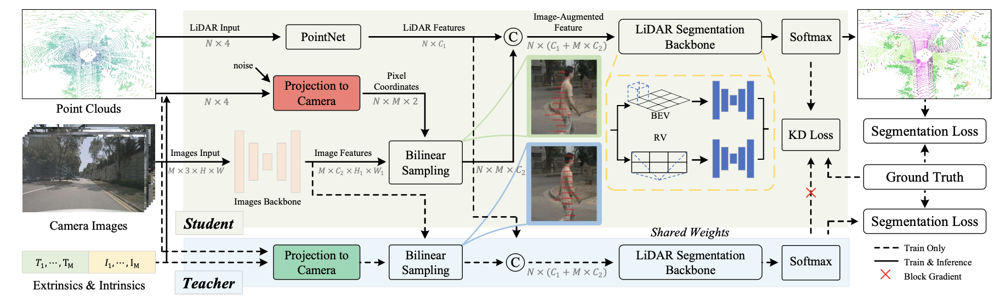
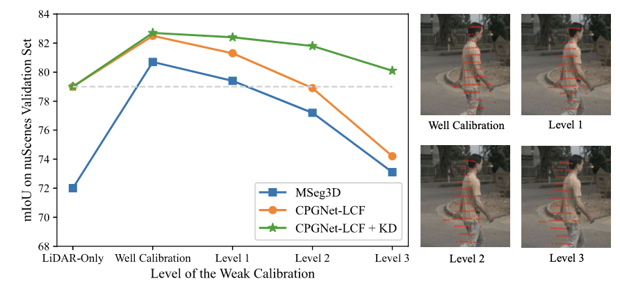

# **Revisiting Multi-modal 3D Semantic Segmentation in Real-world Autonomous Driving (CPGNet-LCF)**


Official code for CPGNet-LCF

## NEWS
- [2023-11-02] CPGNet-LCF achieves the **82.7 mIoU** on the nuScenes LiDAR Segmentation Benchmark with the inference latency of **63 ms**(PyTorch)  and **20 ms**(TensorRT) on a single Tesla V100 GPU.
<!--  -->

#### 1 Dependency

```bash
CUDA>=10.1
torch>=1.10.0
PyYAML@5.4.1
scipy@1.3.1
nuscenes-devkit
```

#### 2 Training Process
##### 2.1 Installation
```bash
cd ops_libs
python setup.py install
```

##### 2.2 Prepare Dataset

Please download the [nuScenes](https://www.nuscenes.org/nuscenes#overview) dataset to the folder `./data` and the structure of the folder should look like:

```
./data
    ├── nuscenes
        ├── ...
        ├── samples/
        │   ├── LIDAR_TOP/
        │   │   ├── n008-2018-05-21-11-06-59-0400__LIDAR_TOP__1526915243047392.pcd.bin
        │   │   ├── n008-2018-05-21-11-06-59-0400__LIDAR_TOP__1526915243547836.pcd.bin
        │   │   ├── ...
        │   ├── CAM_BACK/
        │   │   ├── ...
        │   ├── CAM_FRONT/
        │   │   ├── ...
        │   ├── CAM_FRONT_LEFT/
        │   ├── ...
        └── lidarseg/
            └── v1.0-trainval
                ├── 0a0c9ff1674645fdab2cf6d7308b9269_lidarseg.bin
                ├── ...
```
And download the [pickle file](https://drive.google.com/drive/folders/17yWOaTObDDMRMXMm9yIl75tGJZFrSkhG?usp=sharing) of nuScenes to the folder `./data/nuscenes` 

And download the [model path](https://drive.google.com/file/d/16YEVoOwkXxu9vF8E0rr_mMman8asGxiy/view?usp=sharing) of the image segmentation to the folder `./ckpts` 

##### 2.3 Construct Object Bank
```bash
cd construct_obj_bank/nusc
python3 main.py
```
The structure of the nusc_bank folder should look like:

```
./data/nuscenes
    ├── nusc_bank
        ├── bicycle
        ├── bicyclist
        ├── car
        ├── motorcycle
        ├── motorcyclist
        ├── other-vehicle
        ├── person
        ├── truck
```

##### 2.4 Training Script

```bash
bash train.sh
```

##### 2.5 Training Script with kd

```bash
bash train_kd.sh
```

#### 3 Evaluate Process

```bash
bash evaluate.sh
```

## Acknowlegement
We sincerely thank the authors of [CPGNet](https://github.com/GangZhang842/CPGNet), [SMVF](https://github.com/GangZhang842/SMVF) for open sourcing their methods.

## Contact
Any questions or suggestions are welcome!      
Chaoping Tu <humemarx@gmail.com>     
Gang Zhang <zhanggang11021136@gmail.com>       
